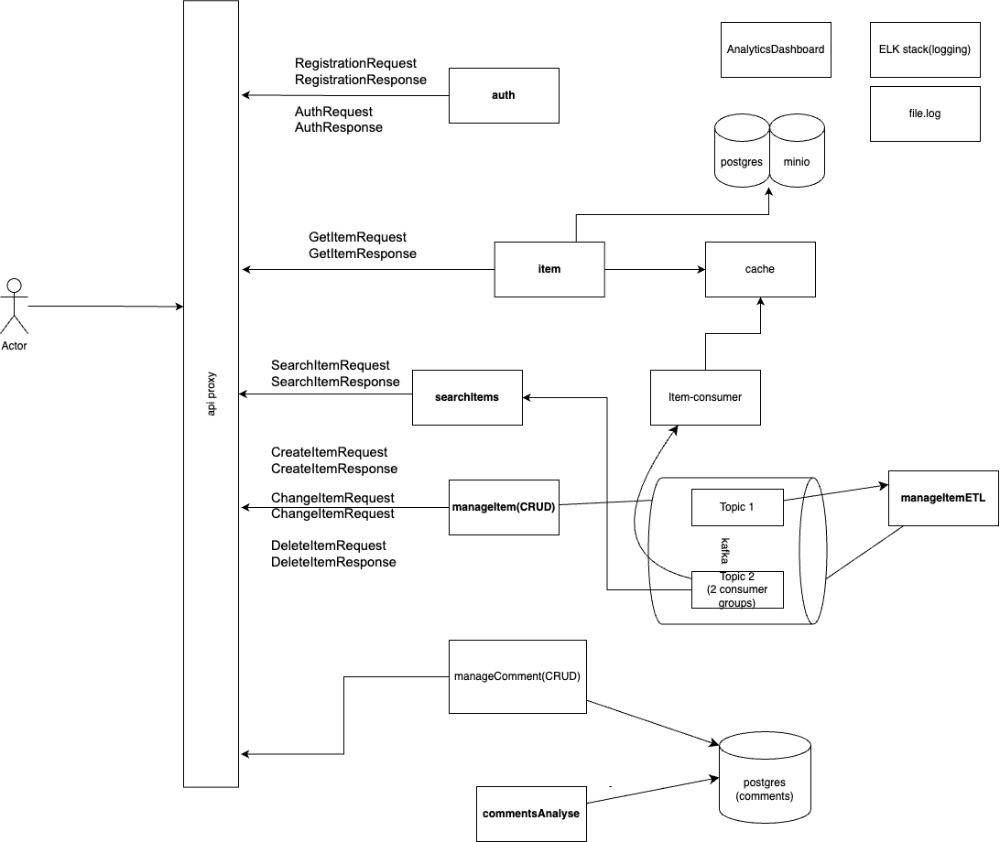

# Онлайн-Магазин (E-Shop)

## Архитектура Системы



## 1. Общее описание проекта

Этот проект представляет собой разработку онлайн-магазина. Основная задача — создать полноценную систему для просмотра и поиска товаров, информации о продавцах, а также для анализа комментариев. Система включает поддержку современного поискового движка и дашборда для аналитики просмотров товаров и пользовательской активности.

Проект спроектирован с учетом высоких нагрузок, предусматривая возможности для масштабирования и митигации проблем, связанных с ресурсоемкими операциями чтения и записи.

## 2. Ключевые возможности

*   **Просмотр и поиск товаров:** Удобный интерфейс для навигации по каталогу и поиска товаров.
*   **Информация о продавцах:** (Предполагается, как часть полной системы).
*   **Анализ комментариев:** Инструменты для обработки и анализа отзывов пользователей о товарах.
*   **Поисковый движок:** Интеграция с Elasticsearch для быстрого и релевантного поиска.
*   **Аналитика:** Дашборд для отслеживания пользовательской активности, просмотров товаров и других метрик.
*   **ETL Пайплайн:** Автоматизированный процесс для обработки и загрузки описаний товаров в систему хранения.
*   **Сбор пользовательской активности:** Механизмы для сбора данных о взаимодействии пользователей с платформой.
*   **Мониторинг и Логирование:** Комплексная система для сбора логов, метрик производительности и трассировки запросов в микросервисной архитектуре.

## 3. Архитектура

Система построена на основе микросервисной архитектуры, как показано на диаграмме выше. Ключевые компоненты включают:

*   **API Proxy (`proxy-service`):** Единая точка входа для всех клиентских запросов, маршрутизирующая их к соответствующим внутренним сервисам.
*   **Сервис Аутентификации (`sso`, `auth` на диаграмме):** Управляет регистрацией, входом пользователей и авторизацией.
*   **Сервис Товаров (`item` на диаграмме, реализуется через `manage-item-crud`, `search_service`, `facade-app`):** Отвечает за информацию о товарах, их получение и отображение.
*   **Сервис Поиска (`searchitems` на диаграмме, `search_service`):** Обеспечивает функциональность поиска по товарам, интегрирован с Elasticsearch.
*   **CRUD Сервисы (`manage-item-crud`, `manageComment(CRUD)` на диаграмме):** Предоставляют API для создания, чтения, обновления и удаления данных (товары, комментарии).
*   **ETL Сервис (`manageItemETL`):** Обрабатывает события изменения товаров из Kafka, трансформирует данные и загружает их в поисковый индекс (Elasticsearch) и, возможно, другие хранилища.
*   **Обработчик Событий (`item-consumer`, `facade-consumer-app`):** Потребляет события из Kafka для различных целей, например, для обновления кэша или других асинхронных операций.
*   **Kafka:** Используется как брокер сообщений для асинхронного взаимодействия между сервисами и для ETL пайплайна.
*   **Базы данных:**
    *   **PostgreSQL (`db`, `postgres-sso`):** Основное хранилище для структурированных данных (пользователи, товары, заказы, комментарии).
    *   **Elasticsearch (`elasticsearch`):** Используется для полнотекстового поиска и хранения данных для аналитики (например, логи).
    *   **Redis (`redis`):** Применяется для кэширования данных с целью ускорения ответа и снижения нагрузки на основные БД.
    *   **MinIO (`minio`):** Объектное хранилище для файлов, таких как изображения товаров.
*   **Кэш (`cache` на диаграмме, реализуется через `redis`):** Ускоряет доступ к часто запрашиваемым данным.
*   **Аналитический Дашборд (представлен `AnalyticsDashboard` на диаграмме, реализуется через `Grafana`):** Визуализация метрик и данных о пользовательской активности.
*   **Система Логирования (представлен `ELK stack(logging)` на диаграмме):** Сбор, агрегация и анализ логов со всех сервисов. Elasticsearch используется как часть этого стека.
*   **Мониторинг и Трассировка:**
    *   **Prometheus:** Сбор метрик производительности сервисов.
    *   **Grafana:** Визуализация метрик из Prometheus и других источников.
    *   **Jaeger:** Распределенная трассировка запросов между микросервисами.

Взаимодействие элементов системы организовано через API запросы (синхронные) и через обмен сообщениями с использованием Kafka (асинхронные).

## 4. Техническое описание и реализованные задачи

*   **ETL Пайплайн:**
    *   Сервис `manage-item-crud` публикует события о создании/изменении/удалении товаров в топик Kafka (`item-events`).
    *   Сервис `manage-item-etl` подписывается на этот топик, обрабатывает "сырые" события (например, нормализует категории, проверяет цены), и пересылает обогащенные данные в другой топик Kafka для дальнейшей обработки или напрямую обновляет поисковый индекс в Elasticsearch.
*   **Сбор пользовательской активности:** Данные о действиях пользователей (просмотры страниц, поисковые запросы, клики) могут отправляться различными сервисами в Kafka или напрямую в систему аналитики/хранилище логов. Эти данные затем используются для построения дашбордов в Grafana.
*   **Потоковое получение файлов:** Сервисы могут обращаться к MinIO для загрузки и получения файлов (например, изображений товаров).
*   **Логирование:** Каждый микросервис пишет логи. Предполагается использование стека ELK (Elasticsearch, Logstash, Kibana) или аналогичного решения (например, Fluentd, Grafana Loki) для централизованного сбора и анализа логов. Elasticsearch уже присутствует в `docker-compose.yml`.
*   **Метрики:** Большинство сервисов (например, `manage-item-etl`, `search_service`, `sso`, `proxy-service`) настроены или могут быть настроены для экспорта метрик в формате Prometheus. Prometheus собирает эти метрики, а Grafana используется для их визуализации.
*   **Трейсинг:** Jaeger используется для отслеживания пути запросов через различные микросервисы, что помогает в отладке и анализе производительности. Сервисы должны быть инструментированы для отправки данных трейсинга в Jaeger.
*   **Масштабируемость и Отказоустойчивость:**
    *   Микросервисная архитектура позволяет независимо масштабировать отдельные компоненты.
    *   Использование Kafka для асинхронной обработки повышает отказоустойчивость и способность системы справляться с пиковыми нагрузками.
    *   Кэширование с помощью Redis снижает нагрузку на базы данных и ускоряет ответы.
    *   Docker и Docker Compose упрощают развертывание и управление сервисами.

## 5. Используемые технологии

*   **Бэкенд:** Python (FastAPI, Flask), Go
*   **Базы данных:** PostgreSQL, Elasticsearch, Redis
*   **Объектное хранилище:** MinIO
*   **Брокер сообщений:** Apache Kafka
*   **Поисковый движок:** Elasticsearch
*   **Мониторинг и Оповещения:** Prometheus
*   **Визуализация данных и Дашборды:** Grafana
*   **Распределенная трассировка:** Jaeger
*   **Контейнеризация:** Docker, Docker Compose
*   **Веб-сервер/Прокси:** Nginx (часто используется с Docker, либо кастомный прокси-сервис на Go как `proxy-service`)
*   **Библиотеки для Kafka:** `aiokafka` (Python)
*   **Библиотеки для Prometheus:** `prometheus-client` (Python)

## 6. Запуск проекта

### Инструкции по запуску

1.  **Клонируйте репозиторий:**
    ```bash
    git clone <https://github.com/Riter/E-Shop.git>
    cd <E-Shop>
    ```

2.  **Настройка окружения:**
    Убедитесь, что у вас есть необходимые файлы окружения (`.env`). Возможно, потребуется создать их на основе примеров (`.env.example`), если они есть. Основные файлы конфигурации, упомянутые в `docker-compose.yml`:
    *   `elastic_search_service/environment/.env` (для PostgreSQL `db` и MinIO)
    *   `elastic_search_service/environment/elastic.env` (для Elasticsearch)
    *   `elastic_search_service/environment/api.env` (для `search_service`)
    *   `sso/environment/postgres.env` (для `postgres-sso`, `migrate`, `sso`)
    *   `proxy/.env` (для `proxy-service`)
    *   `prometheus/prometheus.yml` (конфигурация для Prometheus, не .env файл, но важен для метрик)

    Заполните их необходимыми значениями (пароли, ключи API, адреса хостов и т.д.).

3.  **Запуск скрипта make.sh:**
    Перед сборкой Docker-контейнеров необходимо запустить скрипт make.sh для обновления Go-модулей:
    ```bash
    chmod +x make.sh
    ./make.sh
    ```

4.  **Сборка и запуск контейнеров:**
    Выполните команду в корневой директории проекта:
    ```bash
    docker-compose up -d --build
    ```
    Эта команда соберет образы для ваших сервисов (если они изменились) и запустит все сервисы в фоновом режиме (`-d`).

5.  **Доступ к сервисам:**
    После успешного запуска, основные сервисы будут доступны по следующим адресам (порты могут отличаться в зависимости от вашей конфигурации):
    *   **API Прокси (основное приложение):** `http://localhost:8002` (согласно `proxy-service` в `docker-compose.yml`)
    *   **Prometheus:** `http://localhost:9090`
    *   **Grafana:** `http://localhost:3000` (логин/пароль по умолчанию: admin/admin)
    *   **Jaeger UI:** `http://localhost:16686`
    *   **MinIO Console:** `http://localhost:29046` (порт консоли, основной порт S3 API: `29045`)
    *   **Kibana (если используется с Elasticsearch для логов):** (обычно `http://localhost:5601`)
    *   Другие сервисы, если у них есть открытые порты (например, `manage-item-crud` на `8000`, `search_service` на `51842`).

### Остановка проекта
```bash
docker-compose down
```

### Просмотр логов
Для просмотра логов всех сервисов:
```bash
docker-compose logs -f
```
Для конкретного сервиса:
```bash
docker-compose logs -f <имя_сервиса>
# Например: docker-compose logs -f manage-item-etl
```

## 7. Структура сервисов (обзор из `docker-compose.yml`)

*   `db`: Основная база данных PostgreSQL для товаров, пользователей и т.д.
*   `kafka`, `kafka-setup`: Брокер сообщений Apache Kafka и сервис для инициализации топиков.
*   `minio`: S3-совместимое объектное хранилище.
*   `elasticsearch`: Поисковый движок и хранилище для логов/аналитики.
*   `search_service`: Сервис, отвечающий за поисковые запросы к Elasticsearch.
*   `manage-item-crud`: Сервис для управления товарами (создание, изменение, удаление), публикующий события в Kafka.
*   `manage-item-etl`: ETL-сервис, обрабатывающий события товаров из Kafka.
*   `facade-consumer-app`: Пример консьюмера Kafka (Go).
*   `facade-app`: Фасадный сервис (Go).
*   `redis`: In-memory кэш.
*   `postgres-sso`, `migrate`, `sso`: Компоненты системы единого входа (Single Sign-On).
*   `prometheus`: Система сбора метрик.
*   `grafana`: Система визуализации метрик и дашбордов.
*   `proxy-service`: Центральный API шлюз/прокси.
*   `jaeger`: Система распределенной трассировки.
*   `test_curl`: Тестовый сервис для проверки доступности других сервисов.

--- 
